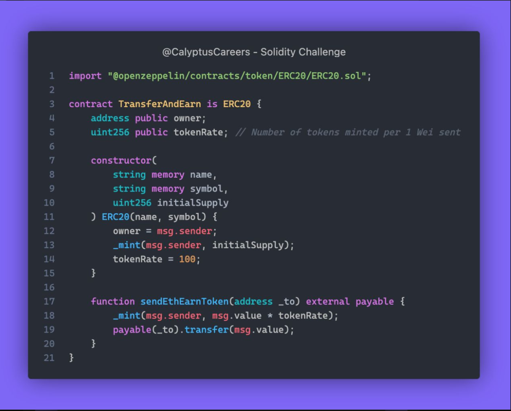

# Challenge 477

Can you hack this contract to get all the reward tokens without sending a dime to someone else?

free tokens without paying a dime!!

In `sendEthEarnToken` function below, tokens are minted directly to `msg.sender` while `ETH` is sent to `to` address. To exploit the function, a user can easily set `to` address the same as `msg.sender` that way the user will get free tokens and the same `ETH` he initially sent to the contract back.

