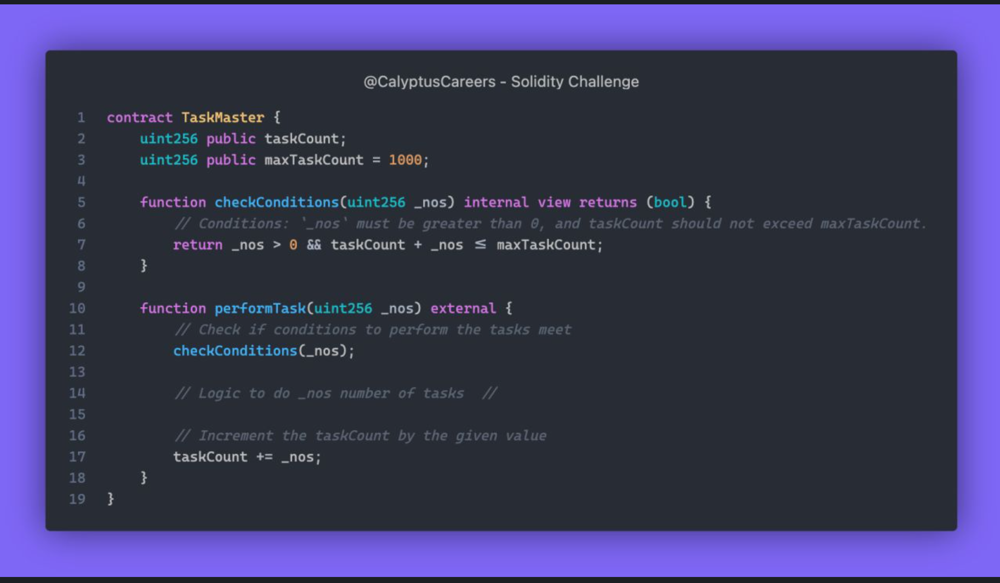

# Challenge 478


Meet the TaskMaster contract - a tireless worker with a limit! 1000 tasks are the number before retirement comes knocking! Do you think the TaskMaster will be able to retire gracefully?




<details>
<summary>Graceful Retirement</summary>
In `performTask` function, it only checks if `_nos` is greater than zero and less than `maxTaskCount` but it doesn't enforce retirement once the `maxTaskCount` is reached.


```
pragma solidity 0.8.20;

contract TaskMaster {


    uint256 public taskCount;
    uint256 constant maxTaskCount = 1000;

    function checkCondition(uint256 _nos) internal view returns(bool) {
        return _nos > 0 && taskCount + _nos <= maxTaskCount;
    }

    function performTask(uint256 _nos) external {

        if(!checkCondition(_nos)) revert();

        taskCount += _nos;
    }
}
`````
</details>