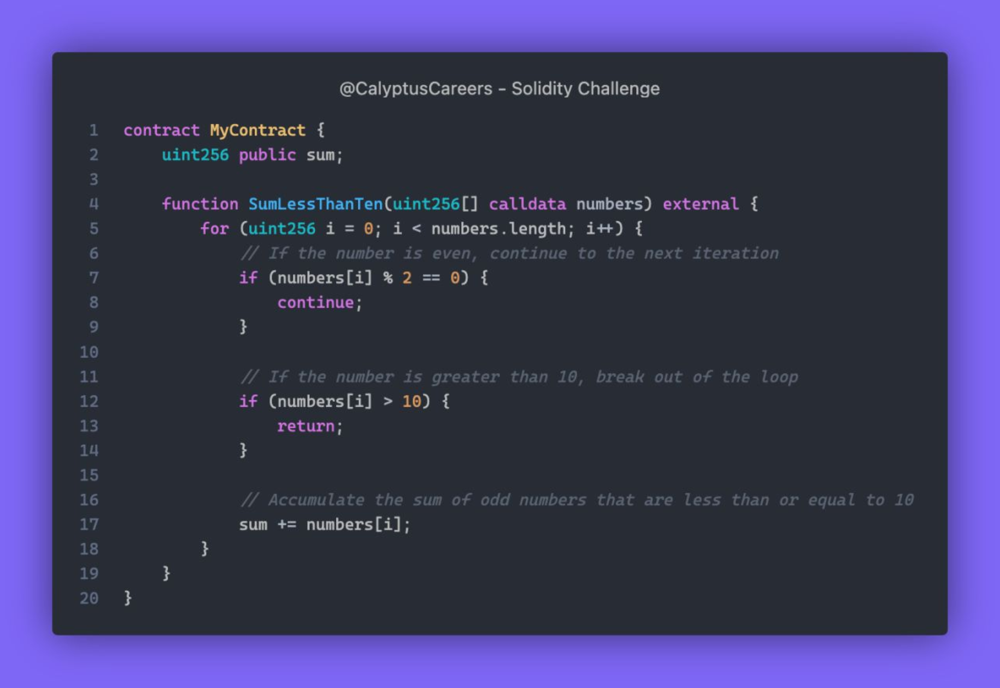

# Solidity Challenge #479 🕵️ 

This contract computes the sum of odd numbers out of the numbers you provide, but it's choosy! If it spots a number greater than 10, it halts the process instantly! 

What can go wrong?



<details>
<summary>How to mitigate function</summary>

First, we've to understand the behavior of each keyword below when used in `for` / `while` loop given example if array [1, 2, 3, 15, 7]:


- `return`: 

- `continue`:

````
for(uint256 i = 0; i < numbers.length; i++) {
    if(numbers[i] % 2 == 0) continue;
    if(numbers[i] > 10) break;
    sum += numbers[i];
}
``````
- `break`: stops the loop only while code after the loop still executes. In given array above

    - 1 => sums up
    - 2 => skips and continue 
    - 3 => sums up
    - 15 => skips and continue
    - 7 => sums up
    - sum => 1 + 3 + 7 = 11

</details>


